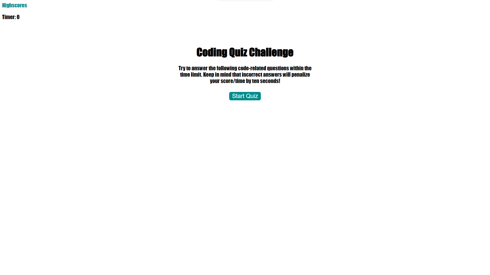

# Code Quiz

## Purpose

An application that allows users to take a timed quiz on JavaScript fundamentals. Scores are savwd to allow users to guage their progress compared to their peers.

## Built With

- HTML
- CSS
- JavaScript

## Website

https://mo9399.github.io/code-quiz/

## Preview

## Contribution

Made by Mohamed Abdullahi